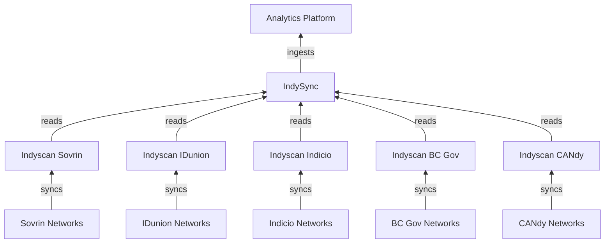

# IndySync

IndySync is the internal software to ingest DID-Document for indy-networks into the Analytics-Platform. I heavily relies on [IndyScan](https://github.com/Patrik-Stas/indyscan) to scan the networks. The process involves processing the Elasticsearch data from IndyScan and transforming it into a valid DID-Document, including the available metadata on chain. Doing this in a linear way, allows also to build up the history of each DID-Document. This is an additional feature which is currently not available e.g. in the [Universal-Resolver](https://github.com/decentralized-identity/universal-resolver). The resulting DID-Resolution-Result Document is then ingested into the Analytics-Platform for further processing.

Basic architecure diagram of IndySync and its interactions with other components is shown below:
