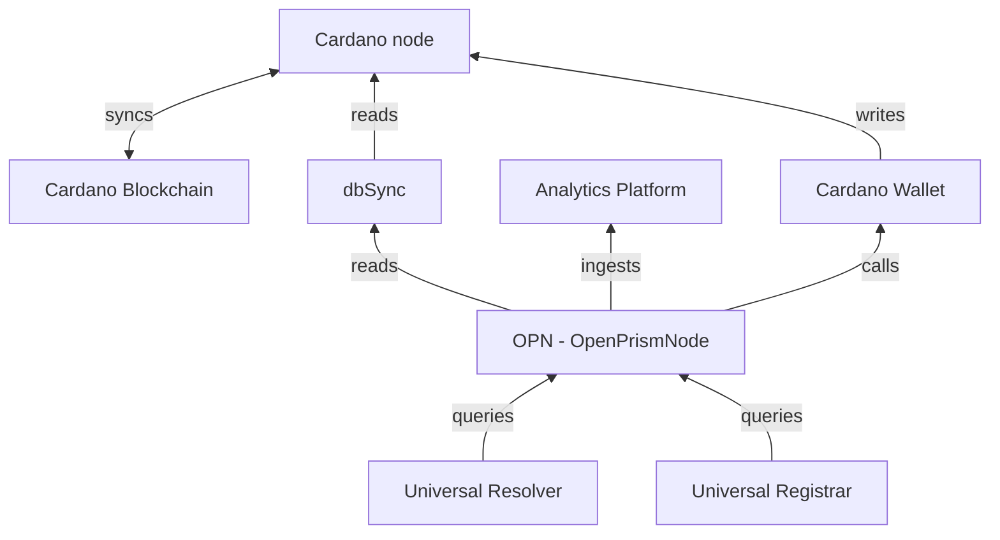

# OPN - OpenPrismNode

The OpenPrismNode (OPN) is an open source implementation of the PRISM node by IOG and follows the [DID-PRISM specification](https://github.com/input-output-hk/prism-did-method-spec/blob/main/w3c-spec/PRISM-method.md).
The purpose of the OPN in this context is to provide the Analytics-Platform with up-to-date data from the PRISM network (preprod and mainnet). This is done by scanning the relevant Cardano network for new blocks and evaluate the transaction content for relevant PRISM metadata.

A detailed explanation on how PRISM metadata is stored in Cardano transactions can be found in the specification. The scanned operations then get evaluated and stored in the OPN database. Meanwhile the OPN performs signature validation, checks the validity of each transaction in context to prior blocks and applies a set of validation rules. It also references each operation to prior or following updates or deactivations.

The combined data is then made available as an [Universal-Resolver](https://github.com/decentralized-identity/universal-resolver) compliant API Endpoint and also get injected in form of a [DID-Resolution-Result Document](https://w3c.github.io/did-resolution/#did-resolution-result) into the ingestion endpoints of the Analytics-Platform to use this data for the public-pool.

For more information and source code, visit the [OpenPrismNode GitHub repository](https://github.com/bsandmann/OpenPrismNode)

A simplified architecture diagram of the OPN and its interactions with other components is shown below:

